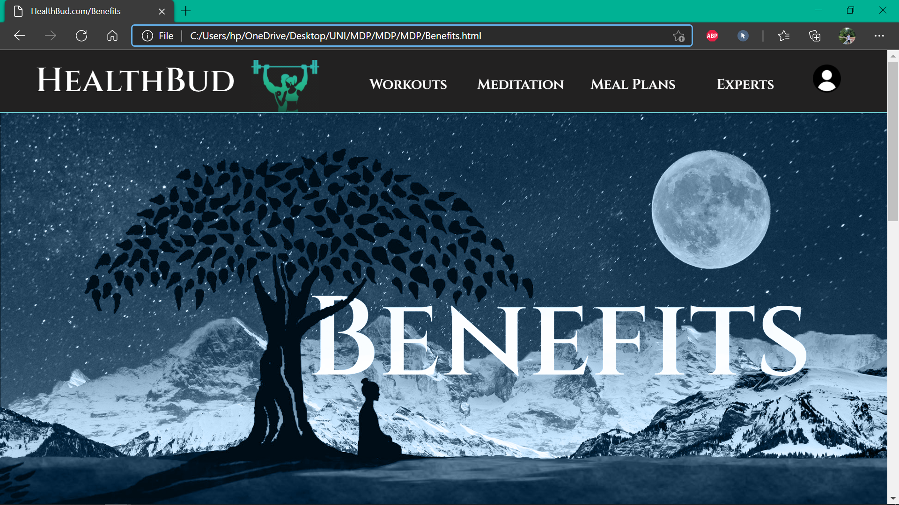

# MDP_HealthBud

Our website - <b>HealthBud</b> is for people who don't have the time or the desire to go to the gym or to group fitness classes. It provides set of workout plans, yoga and meditation tips along with some nutritional dietary needs for their overall development of mind, body and soul- all at the comfort of their home. 
Using <b>Django</b> and <b>PostgreSQL</b>

<h3>1. Benefits of Meditation</h3>

<h3>2. Types of Asanas</h3>

<h3>3. Chakras and their importance</h3>

<h3>4. Meal Plans</h3>

<h3>5. How to Gain Weight</h3>

<h3>6. Contents of the Aritcle</h3>

